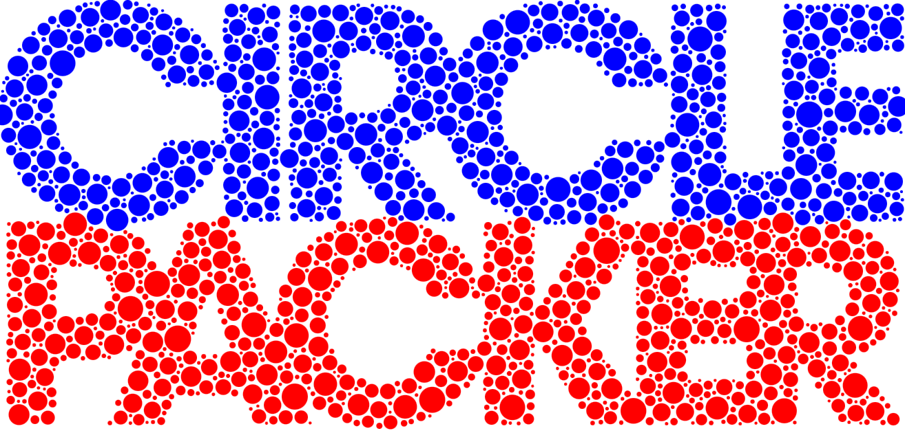

Simple circle-packing library based on [Ken Goulding's gist](https://gist.github.com/gouldingken/8d0b7a05b0b0156da3b8) and [Kevin Dorff's png2svgcircles](https://github.com/kdorff/png2svgcircles/):

- removes jquery dependency
- uses modern javascript/typescript
- provides esm and umd builds
- helper functions for reading and writing images
- passes through original colors 
- fix misc issues with original code

## Usage

Install: `npm install @mtillmann/circlepacker`

Typically you'd use one of the `from*`-functions to create an instance and then use one of the `as*`-methods to render the circles to the format you need:

```javascript
import { fromCircle } from "@mtillmann/circlepacker";
document.body.appendChild(fromCircle(200, 'red').asSVG());
```

The basic concept is to create an instance of `CirclePacker` and call the `render` method with an `ImageData` object and the width of the image. The `render` method will generate and return a list of packed circles for the given `ImageData` object.

The `CirclePacker` provides several helpers that return renderings of the packed circles.

> The `render`-method always needs the width of the source image as the second argument to work correctly!

### ESM Bundler
```javascript
import { CirclePacker } from "@mtillmann/circlepacker";

const instance = new CirclePacker();
instance.render(imageData, imageWidth);
```
### ESM Browser
```html
<script type="module">
    import { CirclePacker } from ".../@mtillmann/circlepacker/dist/index.js";

    const instance = new CirclePacker();
    instance.render(imageData, imageWidth);
</script>
```
### UMD Browser
```html
<script src=".../@mtillmann/circlepacker/dist/index.umd.js"></script>
<script>
    //note the namespace
    const instance = new MTCP.CirclePacker();
    instance.render(imageData, imageWidth);
</script>
```

### node

When using node, you need to install `canvas` (`npm install canvas@next`), then either pass the `CanvasRenderingContext2D` object to the `fromContext2D`-function, use the `fromCanvas`-function or a `CirclePacker`-instance's `render` method.

```javascript
import { fromCanvas, CirclePacker } from "@mtillmann/circlepacker";
import { createCanvas } from "canvas"

const canvas = createCanvas(200, 200)
const ctx = canvas.getContext('2d')
ctx.fillStyle = 'red'
ctx.fillRect(0, 0, 200, 200)

console.log(fromCanvas(canvas).asSVGString());
```
In node basically only `asSVGString` and `asArray` work. To create bitmaps, use
`asArray` to get the circles, then draw them with the canvas library.


### Options
Options can be passed to the class constructor and to any of the `from*` functions as the last argument. The following options are available:

| Option | Type | Default | Description |
| --- | --- | --- | --- |
| spacing | `number` | 1 | Spacing of the circles | 
| numCircles | `number` | 1000 | Number of circles to draw |
| minRadius | `number` | 1 | Minimum radius of the circles |
| maxRadius | `number` | 10 | Maximum radius of the circles |
| higherAccuracy | `boolean` | false | Use higher accuracy for circle packing |
| colors | `string\|Array<string>` | 'auto' | If 'auto', the input ImageData's colors are used. If an array of colors is given, the given colors are used randomly |
| minAlpha | `number` | 1 | Minimum alpha value of input pixels to be considered. If the alpha value of a pixel is below this value, it is ignored |

### ExportOptions

Export options can be passed to most of `as*` methods. The following options are available:

| Option | Type | Default | Description |
| --- | --- | --- | --- |
| scale | `number` | `globalThis.devicePixelRatio || 1` | Scale of the output image - only useful for canvas and image renders. Default value prevents blurry images |
| quality | `number` | 1 | Quality float of the desired image format. Only works when Image is rendered. |
| format | `string` | 1 | Desired Format of rendered image |


## Input Helpers

### `async!` fromBlob(blob:Blob, options:Options)

Creates instance from blob data with given options.

### fromCanvas(canvas:HTMLCanvasElement, options:Options)

Creates instance from canvas element.

### fromCircle((radius:number, color:string,options:Options)

Draws a circle with given radius and color, then creates instance from it.

### fromContext2D(ctx:CanvasRenderingContext2D, options:Options)

Creates instance from canvas context.

### fromImage(image:HTMLImageElement, options:Options)

Creates instance from image element.

### fromImageData(imageData:ImageData, imageWidth:number, options:Options)

Creates an instance from given image data. Alias for `new CirclePacker(imageData, imageWidth, options).render(imageData, imageWidth)`.

### fromRect(width:number, height:number, color:string, options:Options)

Draws a rectangle with given width, height and color, then creates instance from it.

### fromSquare(edgeLength:number = 200, color:string="black", options:Options)

Draws a square with given edge length and color, then creates instance from it.

### `async!` fromURL

Fetches image from given url, then creates instance from it.

## Output Helpers

Output helpers exist on the instance and can be called after the `render` method has been called.

### asCanvas(options:ExportOptions)

Returns a canvas element with the circles drawn on it.

### asImageData(options:ExportOptions)

Returns an ImageData object with the circles drawn on it.

### `async!` asBlob(options:ExportOptions)

Returns a blob of the image with the circles drawn on it. Supports Format and Quality options.

### `async!` asBlobURL(options:ExportOptions)

Returns a blob url of the image with the circles drawn on it. Supports Format and Quality options.

### asDataURL(options:ExportOptions)

Returns a data url of the image with the circles drawn on it. Supports Format and Quality options.

### asSVG(options:ExportOptions)

Returns an SVG node with the circles drawn on it.

### asSVGString(options:ExportOptions)

Returns an SVG string with the circles drawn on it.

### asArray()

Returns an array of circle objects, basically a getter for the internal placedCircles array.